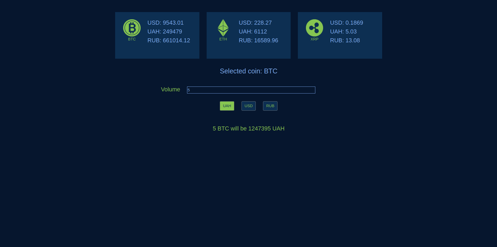

This project was bootstrapped with [Create React App](https://github.com/facebook/create-react-app).

## Available Scripts

In the project directory, you can run:

### `yarn start`

Runs the app in the development mode. 
Open [http://localhost:3000](http://localhost:3000) to view it in the browser.

React application Cryptocurrency widget . 
Cryptocurrency used in aplication such as BTC, ETH, XRP. 
Web Application will send request every five minutes for update information. 
 

